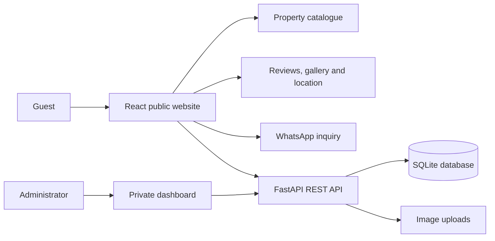

<div align="center">

# Apart Rincón

### Full-stack rental showcase and reservation management platform

[](https://react.dev/)
[](https://vite.dev/)
[](https://fastapi.tiangolo.com/)
[](https://www.python.org/)
[](https://www.sqlite.org/)
[](https://git-scm.com/)

[Live website](https://www.apartrinconcba.com/) · [API reference](#api-reference) · [Run locally](#run-locally)

</div>

## Overview

Apart Rincón is a full-stack web platform built for a real short-term rental business in Alta Gracia, Córdoba, Argentina.

The application combines a responsive public website with a private operational dashboard. Guests can explore the properties, services, photographs, reviews and location before starting a personalized WhatsApp inquiry. Administrators manage property content, gallery images and the reservation calendar through protected API routes.

This project demonstrates how I translate a real business workflow into a deployed application with a React frontend, a FastAPI REST API and persistent data storage.

## Business workflow



Availability is intentionally kept private. Guests browse the catalogue and contact the business directly, while staff register reservations and blocked dates in the administrative calendar.

## Key features

### Public experience

- Responsive multi-page website built with React and Vite.
- Property catalogue with capacity, services, accessibility information and image sliders.
- General photo gallery managed independently from property images.
- Google review highlights, map integration and business contact information.
- Pre-filled WhatsApp links that simplify availability enquiries.
- Content loaded from a FastAPI REST API.

### Private administration

- Credential-based login with signed, expiring bearer sessions and temporary lockout after repeated failures.
- Property content editing and multiple image uploads.
- Gallery image upload and deletion workflows.
- Reservation creation, editing, status management and deletion.
- Private calendar data for each property.
- Date validation and conflict detection for overlapping reservations or blocked periods.
- Booking statuses for `pending`, `reserved`, `blocked`, `completed` and `cancelled` workflows.

## Tech stack

| Layer | Technologies | Purpose |
|---|---|---|
| Frontend | React 18, JavaScript, Vite 5, CSS, Lucide React | Responsive interface and administrative workflows |
| Backend | Python, FastAPI, Uvicorn | REST API, authentication and business rules |
| Validation | Pydantic | Request models, date validation and status validation |
| Data | SQLite | Properties, gallery images and reservations |
| Media | FastAPI uploads and static file serving | Property and gallery image management |
| Integration | WhatsApp, Google Maps, Google Reviews, Instagram | Customer contact and business presence |
| Deployment | Vercel, custom domain, separately deployed API | Production delivery |
| Workflow | Git and GitHub | Version control and project documentation |

## Architecture and engineering decisions

- **Separated frontend and backend:** the React client consumes a dedicated REST API, keeping presentation and business logic independent.
- **Protected operational data:** public routes expose catalogue and gallery content; reservation and administration routes require authorization.
- **Server-side business rules:** the API rejects invalid date formats and returns an HTTP `409` response when an active reservation or block overlaps an existing one.
- **Environment-based configuration:** API URLs, credentials, tokens, database paths and external links are configured outside the source code.
- **Development-only API documentation:** Swagger UI, ReDoc and the OpenAPI document are disabled when the API runs with `ENVIRONMENT=production`.
- **Controlled origins:** CORS is configured for the production domains and local development clients.
- **Data minimization:** guest name, phone and notes are automatically anonymized after the configured retention period.
- **Upload hardening:** image size, MIME type, extension and file signature are validated before storage; removed local images are deleted from disk.

## Project structure

```text
apart-rincon/
├── backend/
│   ├── app/
│   │   ├── __init__.py
│   │   └── main.py          # API, models, database setup and business rules
│   ├── .env.example
│   └── requirements.txt
├── frontend/
│   ├── public/              # Static assets
│   ├── src/
│   │   ├── App.jsx          # Public site and admin interface
│   │   ├── main.jsx
│   │   └── styles.css
│   ├── .env.example
│   ├── package.json
│   ├── vercel.json
│   └── vite.config.js
└── README.md
```

## Run locally

### Prerequisites

- Python 3.10 or newer
- Node.js 18 or newer
- npm
- Git

### 1. Clone the repository

```bash
git clone https://github.com/TheKhadaJhin/apart-rincon.git
cd apart-rincon
```

### . Start the backend

```bash
cd backend
python -m venv .venv
```

Activate the virtual environment:

```bash
# macOS/Linux
source .venv/bin/activate

# Windows PowerShell
.venv\Scripts\Activate.ps1
```

Install the dependencies and create your environment file:

```bash
pip install -r requirements.txt
cp .env.example .env
```

On Windows, use `copy .env.example .env` if `cp` is unavailable.

Replace the placeholder administrator credentials and JWT signing secret in `.env`, then start the API:

```bash
uvicorn app.main:app --reload
```

The API will be available at `http://127.0.0.1:8000`. In development, interactive documentation is available at `http://127.0.0.1:8000/docs`.

### 3. Start the frontend

Open a second terminal:

```bash
cd apart-rincon/frontend
npm install
cp .env.example .env
npm run dev
```

The frontend will be available at `http://localhost:5173`.

## Environment variables

### Backend

| Variable | Description | Local example |
|---|---|---|
| `ADMIN_USER` | Administrator login username | `admin@example.com` |
| `ADMIN_PASSWORD` | Administrator login password | Use a strong private value |
| `ADMIN_TOKEN` | Secret used to sign short-lived admin sessions | Use at least 32 random characters |
| `ADMIN_SESSION_MINUTES` | Admin session lifetime | `60` |
| `FRONTEND_URL` | Allowed frontend origin | `http://localhost:5173` |
| `DATABASE_PATH` | SQLite database location | `./apartrincon.db` |
| `UPLOAD_DIR` | Uploaded-image directory | `./static/uploads` |
| `UPLOAD_MAX_BYTES` | Maximum uploaded image size | `8388608` |
| `BOOKING_PERSONAL_DATA_RETENTION_DAYS` | Days before guest fields are anonymized | `365` |
| `PRIVACY_CLEANUP_INTERVAL_SECONDS` | Frequency of automatic retention cleanup | `3600` |
| `ENVIRONMENT` | Set to `production` to disable API documentation | `development` |

### Frontend

| Variable | Description | Local example |
|---|---|---|
| `VITE_API_URL` | Base URL for the FastAPI service | `http://127.0.0.1:8000` |
| `VITE_WHATSAPP_NUMBER` | WhatsApp number in international format | `5490000000000` |
| `VITE_GOOGLE_MAPS_EMBED_URL` | Google Maps embed URL | Optional |
| `VITE_GOOGLE_REVIEWS_URL` | Public Google Reviews URL | Optional |
| `VITE_INSTAGRAM_URL` | Business Instagram profile | Optional |

> Never commit the `.env` files, production credentials, bearer tokens, the production database or customer reservation data.

## API reference

### Public routes

| Method | Route | Purpose |
|---|---|---|
| `GET` | `/` | API information |
| `GET` | `/api/health` | Service health check |
| `GET` | `/api/properties` | Active property catalogue |
| `GET` | `/api/properties/{property_id}` | Property details |
| `GET` | `/api/gallery` | Public gallery images |
| `POST` | `/api/auth/login` | Administrator authentication |

### Protected administration routes

| Method | Route | Purpose |
|---|---|---|
| `GET` | `/api/admin/properties` | List properties for administration |
| `PUT` | `/api/admin/properties/{property_id}` | Update a property |
| `POST` | `/api/admin/properties/{property_id}/images` | Upload property images |
| `GET` | `/api/admin/gallery` | List all gallery images |
| `POST` | `/api/admin/gallery/images` | Upload a gallery image |
| `DELETE` | `/api/admin/gallery/{image_id}` | Delete a gallery image |
| `GET` | `/api/admin/bookings` | List bookings and blocks |
| `POST` | `/api/admin/bookings` | Create a booking or block |
| `PATCH` | `/api/admin/bookings/{booking_id}` | Update a booking |
| `DELETE` | `/api/admin/bookings/{booking_id}` | Delete a booking |
| `POST` | `/api/admin/privacy/purge-bookings` | Apply booking-data retention immediately |

Protected routes expect the token in the `Authorization: Bearer <token>` header.

## What this project demonstrates

- Turning real operational requirements into a working data model and API.
- Full-stack development across UI, business logic, storage and deployment.
- REST API design with validation, authorization and meaningful HTTP errors.
- Responsive interfaces for public users and private administrative workflows.
- Integration of external services without exposing private reservation data.
- Iterative delivery using Git and production deployments.

## Possible next steps

- Add automated API and frontend tests.
- Migrate production data to PostgreSQL.
- Store uploaded media in an object-storage service.
- Add Docker-based local development.
- Add continuous integration for tests and code quality checks.
- Store administrator identities in a dedicated database with password hashing and optional multi-factor authentication.

## Author

Built by [Mario Fuentes](https://github.com/TheKhadaJhin) as an end-to-end solution for a real rental business.


```txt
apart-rincon/
  frontend/      React + Vite
  backend/       FastAPI + SQLite
