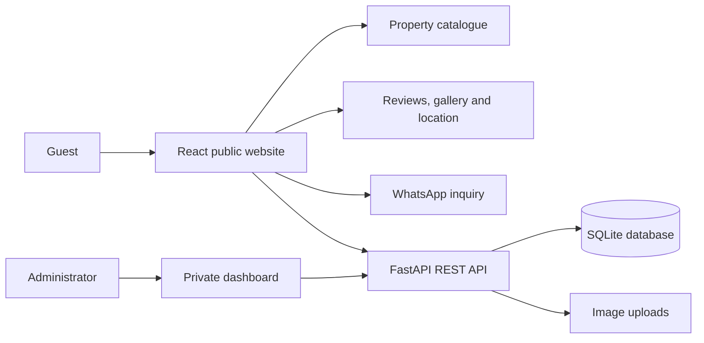

<div align="center">

# Apart Rincón

### Full-stack rental showcase and reservation management platform

[](https://react.dev/)
[](https://vite.dev/)
[](https://fastapi.tiangolo.com/)
[](https://www.python.org/)
[](https://www.sqlite.org/)
[](https://git-scm.com/)

[Live website](https://www.apartrinconcba.com/) · [API reference](#api-reference) · [Run locally](#run-locally)

</div>

## Overview

Apart Rincón is a full-stack web platform built for a real short-term rental business in Alta Gracia, Córdoba, Argentina.

The application combines a responsive public website with a private operational dashboard. Guests can explore the properties, services, photographs, reviews and location before starting a personalized WhatsApp inquiry. Administrators manage property content, gallery images and the reservation calendar through protected API routes.

This project demonstrates how I translate a real business workflow into a deployed application with a React frontend, a FastAPI REST API and database-backed storage.

## Improvements under review

As of **2026-09-24**, [PR #1](https://github.com/TheKhadaJhin/apart-rincon/pull/1)
contains implemented booking validation, expiring administrator sessions and automated
tests. The PR is still open; these improvements have not been merged into `main`.

**One concrete case:** two simultaneous requests attempt to reserve the same property
for the same dates. A SQLite transaction covers both the overlap check and the write,
so one request succeeds with `200` and the other returns `409 Conflict`; only one booking
is stored.

- [Implementation: booking creation and update](https://github.com/TheKhadaJhin/apart-rincon/blob/ea26ec3307746fca335d8391d3999c2f4d812be9/backend/app/main.py).
- [Regression test: `test_simultaneous_creates_do_not_double_book`](https://github.com/TheKhadaJhin/apart-rincon/blob/ea26ec3307746fca335d8391d3999c2f4d812be9/backend/tests/test_bookings.py).
- [Successful CI run from 2026-09-14](https://github.com/TheKhadaJhin/apart-rincon/actions/runs/34868963407): 49 backend tests, 22 frontend tests and the frontend build passed.

This evidence describes the PR's tested code, not a production deployment. The
[administrator migration guide](https://github.com/TheKhadaJhin/apart-rincon/blob/ea26ec3307746fca335d8391d3999c2f4d812be9/docs/ADMIN_ACCESS_MIGRATION.md)
documents the configuration required before deployment.

## Business workflow



Availability is intentionally kept private. Guests browse the catalogue and contact the business directly, while staff register reservations and blocked dates in the administrative calendar.

## Key features

### Public experience

- Responsive multi-page website built with React and Vite.
- Property catalogue with capacity, services, accessibility information and image sliders.
- General photo gallery managed independently from property images.
- Links to publicly verifiable Google reviews, map integration and business contact information.
- Pre-filled WhatsApp links that simplify availability enquiries.
- Content loaded from a FastAPI REST API.

### Private administration

- Argon2id password verification, expiring bearer sessions, server-side logout and a login attempt limit shared across API workers.
- Property content editing and multiple image uploads.
- Gallery image upload and deletion workflows.
- Reservation creation, editing, status management and deletion.
- Private calendar data for each property.
- Date validation and conflict detection for overlapping reservations or blocked periods.
- Booking statuses for `pending`, `reserved`, `blocked`, `completed` and `cancelled` workflows.

## Tech stack

| Layer | Technologies | Purpose |
|---|---|---|
| Frontend | React 18, JavaScript, Vite 5, CSS, Lucide React | Responsive interface and administrative workflows |
| Backend | Python, FastAPI, Uvicorn | REST API, authentication and business rules |
| Validation | Pydantic | Request models, date validation and status validation |
| Data | SQLite | Properties, gallery images and reservations |
| Media | FastAPI uploads and static file serving | Property and gallery image management |
| Integration | WhatsApp, Google Maps, Google Reviews, Instagram | Customer contact and business presence |
| Deployment | Vercel, custom domain, separately deployed API | Production delivery |
| Workflow | Git, GitHub Actions, pytest and Node.js tests | Version control and automated verification |

> **Production persistence requirement:** SQLite and local uploads need a persistent volume. On an ephemeral host, configure durable storage or migrate the database/media to managed services before accepting real reservations.

## Architecture and engineering decisions

- **Separated frontend and backend:** the React client consumes a dedicated REST API, keeping presentation and business logic independent.
- **Protected operational data:** public routes expose catalogue and gallery content; reservation and administration routes require authorization.
- **Server-side business rules:** the API rejects invalid date formats and returns an HTTP `409` response when an active reservation or block overlaps an existing one.
- **Environment-based configuration:** API URLs, administrator password hashes, database paths and external links are configured outside the source code.
- **Development-only API documentation:** Swagger UI, ReDoc and the OpenAPI document are disabled when the API runs with `ENVIRONMENT=production`.
- **Controlled origins:** CORS is configured for the production domains and local development clients.
- **Data minimization:** guest name, phone and notes are automatically anonymized after the configured retention period.
- **Upload hardening:** image size, MIME type, extension and file signature are validated before storage; removed local images are deleted from disk.

## Project structure

```text
apart-rincon/
├── backend/
│   ├── app/
│   │   ├── __init__.py
│   │   └── main.py          # API, models, database setup and business rules
│   ├── .env.example
│   └── requirements.txt
├── frontend/
│   ├── public/              # Static assets
│   ├── src/
│   │   ├── App.jsx          # Public site and admin interface
│   │   ├── main.jsx
│   │   └── styles.css
│   ├── .env.example
│   ├── package.json
│   ├── vercel.json
│   └── vite.config.js
└── README.md
```

## Run locally

### Prerequisites

- Python 3.10 or newer
- Node.js 22 (used in CI)
- npm
- Git

### 1. Clone the repository

```bash
git clone https://github.com/TheKhadaJhin/apart-rincon.git
cd apart-rincon
```

### 2. Start the backend

```bash
cd backend
python -m venv .venv
```

Activate the virtual environment:

```bash
# macOS/Linux
source .venv/bin/activate

# Windows PowerShell
.venv\Scripts\Activate.ps1
```

Install the dependencies and create your environment file:

```bash
pip install -r requirements.txt
cp .env.example .env
```

On Windows, use `copy .env.example .env` if `cp` is unavailable.

Generate a password hash with the hidden prompt:

```bash
python -m app.hash_password
```

Set your private `ADMIN_USER` in `.env` and paste the complete `ADMIN_PASSWORD_HASH='...'` line printed by the command. The password must contain 12–256 characters. Keep the hash in the backend environment only.

Start the API:

```bash
uvicorn app.main:app --reload
```

The API will be available at `http://127.0.0.1:8000`. In development, interactive documentation is available at `http://127.0.0.1:8000/docs`.

### 3. Start the frontend

Open a second terminal:

```bash
cd apart-rincon/frontend
npm ci
cp .env.example .env
npm run dev
```

The frontend will be available at `http://localhost:5173`. Open `/admin` and sign in using the username and password you configured. Sessions last 60 minutes by default; reloading the page requires signing in again.

For an existing installation, follow the [administrator access migration guide](docs/ADMIN_ACCESS_MIGRATION.md) before deployment.

## Environment variables

### Backend

| Variable | Description | Local example |
|---|---|---|
| `ADMIN_USER` | Administrator login username | `admin@example.com` |
| `ADMIN_PASSWORD_HASH` | Argon2id password hash generated by `python -m app.hash_password` | Paste the generated hash; never the plaintext password |
| `ADMIN_SESSION_MINUTES` | Session lifetime in minutes, from 5 to 1440 | `60` |
| `FRONTEND_URL` | Allowed frontend origin | `http://localhost:5173` |
| `DATABASE_PATH` | SQLite database location | `./apartrincon.db` |
| `UPLOAD_DIR` | Uploaded-image directory | `./static/uploads` |
| `UPLOAD_MAX_BYTES` | Maximum uploaded image size | `8388608` |
| `BOOKING_PERSONAL_DATA_RETENTION_DAYS` | Days before guest fields are anonymized | `365` |
| `PRIVACY_CLEANUP_INTERVAL_SECONDS` | Frequency of automatic retention cleanup | `3600` |
| `ENVIRONMENT` | Set to `production` to disable API documentation | `development` |

### Frontend

| Variable | Description | Local example |
|---|---|---|
| `VITE_API_URL` | Base URL for the FastAPI service | `http://127.0.0.1:8000` |
| `VITE_WHATSAPP_NUMBER` | WhatsApp number in international format | `5490000000000` |
| `VITE_GOOGLE_MAPS_EMBED_URL` | Google Maps embed URL | Optional |
| `VITE_GOOGLE_REVIEWS_URL` | Public Google Reviews URL | Optional |
| `VITE_INSTAGRAM_URL` | Business Instagram profile | Optional |

> Never commit the `.env` files, production credentials, bearer tokens, the production database or customer reservation data.

## API reference

### Public routes

| Method | Route | Purpose |
|---|---|---|
| `GET` | `/` | API information |
| `GET` | `/api/health` | Service health check |
| `GET` | `/api/properties` | Active property catalogue |
| `GET` | `/api/properties/{property_id}` | Property details |
| `GET` | `/api/gallery` | Public gallery images |
| `POST` | `/api/auth/login` | Administrator authentication |

### Protected administration routes

| Method | Route | Purpose |
|---|---|---|
| `POST` | `/api/auth/logout` | Revoke the current administrator session |
| `GET` | `/api/admin/properties` | List properties for administration |
| `PUT` | `/api/admin/properties/{property_id}` | Update a property |
| `POST` | `/api/admin/properties/{property_id}/images` | Upload property images |
| `GET` | `/api/admin/gallery` | List all gallery images |
| `POST` | `/api/admin/gallery/images` | Upload a gallery image |
| `DELETE` | `/api/admin/gallery/{image_id}` | Delete a gallery image |
| `GET` | `/api/admin/bookings` | List bookings and blocks |
| `POST` | `/api/admin/bookings` | Create a booking or block |
| `PATCH` | `/api/admin/bookings/{booking_id}` | Update a booking |
| `DELETE` | `/api/admin/bookings/{booking_id}` | Delete a booking |
| `POST` | `/api/admin/privacy/purge-bookings` | Apply booking-data retention immediately |

Protected routes expect the token in the `Authorization: Bearer <token>` header. Login returns `access_token`, `token_type` and `expires_in` (seconds). The database stores a token digest, expiry and credential version. Logout revokes the current session; changing the configured username or password hash invalidates previous sessions after API workers restart.

The browser keeps the token in memory and clears private data on logout or expiry. If logout cannot reach the API, the panel closes locally and explains that server revocation was not confirmed.

Login permits five attempts per client IP within 15 minutes; a successful login resets that IP's counter. Further attempts return `429` with `Retry-After`. Deploy behind a correctly configured trusted proxy as described in the migration guide.

For booking updates, omit fields to keep their values; explicit `null` is rejected with `422`. Use an empty string to clear guest name, phone or notes. Dates must use `YYYY-MM-DD`, checkout must be after check-in, and the property must exist. Conflict checks and writes share a SQLite transaction so concurrent reservations cannot claim the same dates.

## What this project demonstrates

- Turning real operational requirements into a working data model and API.
- Full-stack development across UI, business logic, storage and deployment.
- REST API design with validation, authorization and meaningful HTTP errors.
- Responsive interfaces for public users and private administrative workflows.
- Integration of external services without exposing private reservation data.
- Iterative delivery using Git and production deployments.

## Automated verification

[Quality checks and execution results](https://github.com/TheKhadaJhin/apart-rincon/actions/workflows/quality.yml) run on pushes and pull requests. Tests use temporary SQLite databases, synthetic credentials and generated test sessions; no production data or services are needed.

From `backend/`, with the virtual environment active:

```bash
python -m pip install -r requirements-dev.txt
python -m pytest tests -v --cov=app --cov-report=term-missing
```

From `frontend/`:

```bash
npm ci
npm test
npm run build
```

| Evidence | What to inspect |
|---|---|
| [Booking integration tests](backend/tests/test_bookings.py) | Invalid edits, nonexistent properties, overlapping dates, status changes and concurrent booking requests |
| [Authentication integration tests](backend/tests/test_auth.py) | Password verification, session expiry/revocation, credential rotation and shared login throttling |
| [Existing feature regression tests](backend/tests/test_existing_features.py) | Upload validation, file removal, data retention and existing SQLite migration |
| [Frontend session tests](frontend/tests/adminApi.test.mjs) | Authenticated JSON/uploads, expiry, logout, useful API errors and late responses |
| [Authentication implementation](backend/app/security.py) / [frontend API client](frontend/src/adminApi.mjs) | Follow the tested behavior through Python and JavaScript |

CI reports the actual test results and frontend build status. A passing build does not replace a browser check of the deployed administrator workflow.

## Possible next steps

- Add browser tests for the complete administrator workflow.
- Migrate production data to PostgreSQL.
- Store uploaded media in an object-storage service.
- Add Docker-based local development.
- Support multiple administrator accounts and optional multi-factor authentication.

## Author

Built by [Mario Fuentes](https://github.com/TheKhadaJhin) as an end-to-end solution for a real rental business.

